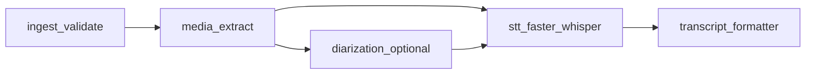

# 아키텍처 개요

`yoyak` 소스 디렉터리 역할과 동영상→전사 파이프라인 흐름을 한곳에서 볼 수 있게 정리합니다.

## 디렉터리·모듈 역할

| 위치 | 역할 |
|------|------|
| [`src/app/core/`](../src/app/core/) | [`pipeline.py`](../src/app/core/pipeline.py)에서 입력 검증부터 전사·포맷까지 순서 조율 |
| [`src/app/services/`](../src/app/services/) | 도메인 로직: [`ingest`](../src/app/services/ingest.py)(파일 검증), [`media`](../src/app/services/media.py)(오디오 추출·트랙 확인), [`stt`](../src/app/services/stt.py)(faster-whisper), [`diarization`](../src/app/services/diarization.py)(선택 화자 구분), [`transcript_formatter`](../src/app/services/transcript_formatter.py)(텍스트·세그먼트 조합), [`speaker_roles`](../src/app/services/speaker_roles.py)(UI 연동 멘토 역할 지정 등) |
| [`src/app/ui/`](../src/app/ui/) | PySide6 화면·설정·결과 패널 |
| [`src/app/utils/`](../src/app/utils/) | 공용 유틸·에러 정의 |
| [`src/app/config.py`](../src/app/config.py), [`constants.py`](../src/app/constants.py) | 설정 로드·앱 상수 |
| [`src/app/main.py`](../src/app/main.py) | 진입점 |

`scripts/`는 화자 구분 모델 준비·검증용 보조 스크립트이며, 상세는 [`diarization.md`](diarization.md)를 참고합니다.

## 처리 흐름 (파이프라인)

[`VideoPipeline.run`](../src/app/core/pipeline.py) 기준입니다. 화자 구분이 켜져 있으면 오디오 추출 뒤 전사 전에 다이어리제이션이 수행되고, 설정에 따라 STT 단어 타임스탬프로 세그먼트를 다시 맞춘 뒤 [`build_transcript`](../src/app/services/transcript_formatter.py)로 최종 문자열·세그먼트를 만듭니다.

## 관련 문서

- 개발 실행·테스트: [`development.md`](development.md)
- 화자 구분·모델: [`diarization.md`](diarization.md)
- 기술 스택 표: [`tech-stack.md`](tech-stack.md)
